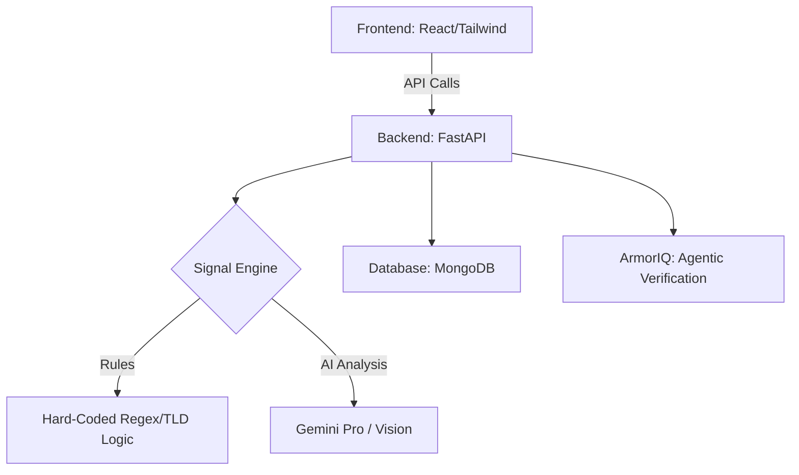

# ByteShield Platform

ByteShield is an AI-powered scam detection platform that analyzes URLs, text, and files to protect users from fraudulent job offers and phishing attempts.

## 🏗️ Project Architecture



---

## 🧰 Tech Stack

### 🔹 Backend
- FastAPI  
- Uvicorn
- Mongo DB  
- Pydantic  
- Python  

### 🤖 AI / ML
- Groq  
- sentence-transformers    

### 🧾 OCR & Processing
- PyMuPDF  
- Pillow  
- BeautifulSoup4  

### 🌐 Domain & Forensics
- python-whois  
- tldextract  
- dnspython  

### 🎨 Frontend
- React 19  
- Vite  
- TypeScript  
- Tailwind CSS  
- Framer Motion  

### 🔌 External Integrations
- SerpAPI   

### 🧩 Browser Extension
- Chrome Extension (Manifest V3)  
- JavaScript  

---

## 🚀 Quick Start (Backend)

### 1. Setup Environment
```cmd
.\backend\venv\Scripts\activate
```

### 2. Install Dependencies
```cmd
cd backend
pip install -r requirements.txt
```

### 3. Configure Environment Variables
Copy `.env.example` to `.env` and fill in your credentials:
```cmd
copy .env.example .env
```

### 4. Run the Server
```cmd
uvicorn app.main:app --reload
```

---

## 👥 Team Workflow (Phase 1)

### Person A: System Architect (Team Lead)
- **Infrastructure**: FastAPI, MongoDB (Motor), and Core Schemas  
- **Rule Engine**: Hard-coded logic for TLDs (`.tk`, `.top`) and payment keywords  
- **Scoring**: Weighted aggregator combining Rules + AI outputs  

### Person B: Intelligence Specialist
- **OCR/Processing**: Extract text from PDFs, screenshots  
- **AI Integration**: Semantic analysis, intent detection, explanation generation  
- **URL Scraper**: Extract and analyze webpage content  

---

## 📄 API Contract (Pydantic Schemas)

All developers must strictly follow the schemas defined in:  
`./backend/app/schemas/scan.py`

- **Request**: `ScanRequest` (Type: url/text/file)  
- **Response**: `ScanResponse`  
  - Score (0–100)  
  - Label (Safe / Suspicious / Scam)  
  - Findings  
  - Evidence  
  - Recommended Actions  
