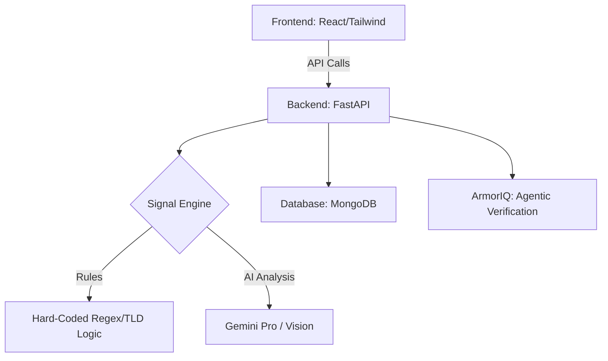

# ScamShield Platform

ScamShield is an AI-powered scam detection platform that analyzes URLs, text, and files to protect users from fraudulent job offers and phishing attempts.

## 🏗️ Project Architecture



## 🚀 Quick Start (Backend)

### 1. Setup Environment
```cmd
.\backend\venv\Scripts\activate
```

### 2. Install Dependencies
```cmd
cd backend
pip install -r requirements.txt
```

### 3. Configure Environment Variables
Copy `.env.example` to `.env` and fill in your credentials:
```cmd
copy .env.example .env
```

### 4. Run the Server
```cmd
uvicorn app.main:app --reload
```

## 👥 Team Workflow (Phase 1)

### Person A: System Architect (Team Lead)
- **Infrastructure**: FastAPI, MongoDB (Motor), and Core Schemas.
- **Rule Engine**: Hard-coded logic for TLDs (`.tk`, `.top`) and payment keywords.
- **Scoring**: Weighted aggregator that combines Rules + AI results.

### Person B: Intelligence Specialist
- **OCR/Processing**: Image-to-text conversion for PDFs/Screenshots.
- **Gemini Integration**: Normalization, intent analysis, and human-readable explanations.
- **URL Scraper**: Content extraction from submitted links.

## 📄 API Contract (Pydantic Schemas)
All developers must strictly follow the schemas defined in:
`./backend/app/schemas/scan.py`

- **Request**: `ScanRequest` (Type: url/text/file)
- **Response**: `ScanResponse` (Score: 0-100, Label, Findings, Evidence, Actions)
